## Part 1. Установка ОС

**== Задание ==**

##### Установить **Ubuntu 20.04 Server LTS** без графического интерфейса. (Используем программу для виртуализации - VirtualBox)

- Графический интерфейс должен отсутствовать.

- Узнайте версию Ubuntu, выполнив команду \
`cat /etc/issue.`
- Вставьте скриншот с выводом команды.

**== Решение ==**

- VirtualBox был установлен для работы с виртуальными машинами.
- С [официального сайта](http://releases.ubuntu.com/20.04/) скачан ISO-образ Ubuntu 20.04.2 Server LTS.
- Операционная система установлена без графической оболочки.

    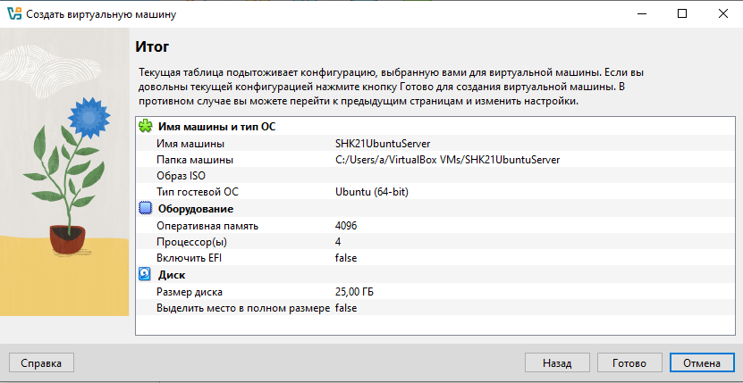

- Результат работы команды `cat /etc/issue`:

    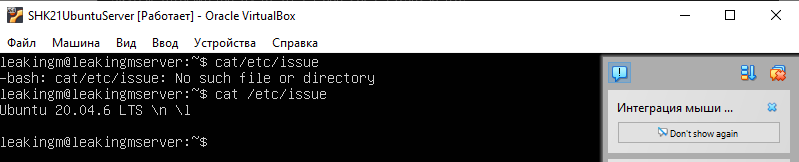

## Part 2. Создание пользователя

**== Задание ==**

##### Создать пользователя, отличного от пользователя, который создавался при установке. Пользователь должен быть добавлен в группу `adm`.

- Вставьте скриншот вызова команды для создания пользователя.
- Новый пользователь должен быть в выводе команды \
`cat /etc/passwd`
- Вставьте скриншот с выводом команды.

**== Решение ==**

- Новый пользователь `newuser` создан командой:
    ```
    sudo adduser newuser
    ```
    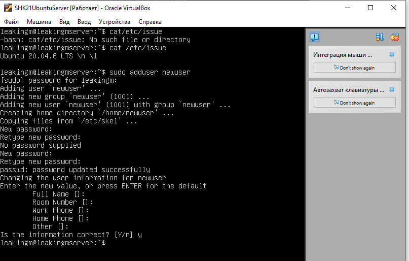

- Пользователь `newuser` добавлен в группу `adm`:
    ```
    sudo usermod -a -G adm newuser
    ```
    

- В выводе команды `cat /etc/passwd` видно, что пользователь создан:

    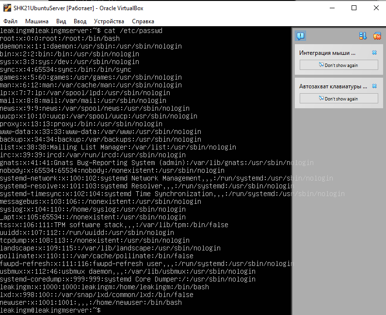

## Part 3. Настройка сети ОС

**== Задание ==**

##### Задать название машины вида user-1  
##### Установить временную зону, соответствующую вашему текущему местоположению.  
##### Вывести названия сетевых интерфейсов с помощью консольной команды.
- В отчёте дать объяснение наличию интерфейса lo.  
##### Используя консольную команду получить ip адрес устройства, на котором вы работаете, от DHCP сервера. 
- В отчёте дать расшифровку DHCP.  
##### Определить и вывести на экран внешний ip-адрес шлюза (ip) и внутренний IP-адрес шлюза, он же ip-адрес по умолчанию (gw). 
##### Задать статичные (заданные вручную, а не полученные от DHCP сервера) настройки ip, gw, dns (использовать публичный DNS серверы, например 1.1.1.1 или 8.8.8.8).  
##### Перезагрузить виртуальную машину. Убедиться, что статичные сетевые настройки (ip, gw, dns) соответствуют заданным в предыдущем пункте.  

- В отчёте опишите, что сделали для выполнения всех семи пунктов (можно как текстом, так и скриншотами).
- Успешно пропинговать удаленные хосты 1.1.1.1 и ya.ru и вставить в отчёт скрин с выводом команды. В выводе команды должна быть фраза "0% packet loss".

**== Решение ==**

- С помощью команды `hostname` определено, что изначально имя машины было `leakingmserver`.

    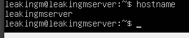

- Имя компьютера изменено на `user-1` командой:
    ```
    sudo hostname user-1
    ```
- Проверка нового имени:
    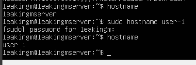

- Для сохранения имени после перезагрузки выполнено:
    ```
    sudo hostnamectl set-hostname user-1
    ```
    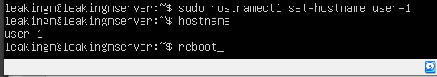

- После перезагрузки имя осталось прежним.

---

- Для проверки текущей временной зоны использована команда `date`, которая показала, что зона не совпадает с местоположением.

    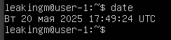

- Часовой пояс изменён на Europe/Moscow:
    ```
    sudo timedatectl set-timezone Europe/Moscow
    ```
    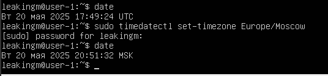

- После этого команда `date` отразила правильное время.

---

- Сетевые интерфейсы отображены командами:
    ```
    ip l
    ip address
    ls /sys/class/net
    ```
    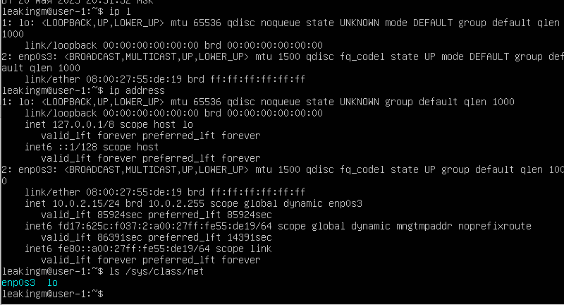

- **Интерфейс lo** — это виртуальное устройство, присутствующее в любой системе Linux по умолчанию. Оно используется для локального взаимодействия программ и всегда имеет адрес 127.0.0.1 (localhost).

---

- Для получения IP-адреса, выданного DHCP, использована команда:
    ```
    cat /var/log/syslog | grep -i dhcp
    ```
    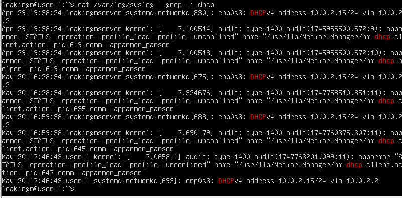

- DHCP назначил IP-адрес: 10.0.2.15/24

- Альтернативно, IP можно узнать командой:
    ```
    ip r
    ```
    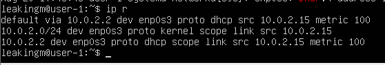

- **DHCP (Dynamic Host Configuration Protocol)** — сетевой протокол, который автоматически выдает устройствам IP-адреса и другие сетевые параметры для работы в сети TCP/IP.

---

- Внешний IP-адрес определён командой:
    ```
    curl ifconfig.co
    ```
    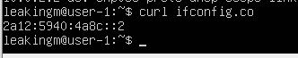

- Внутренний IP шлюза (gw) определён командами:
    ```
    ip route
    route -n
    ```
    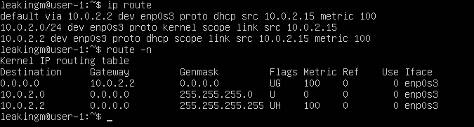

- Внешний IP: 2a12:5940:4a8c::2, внутренний: 10.0.2.2

---

- Для ручной настройки сети отключён cloud-init:
    ```
    sudo vim /etc/cloud/cloud.cfg.d/subiquity-disable-cloudinit-networking.cfg
    ```
    В файле указано: `config: disabled`

    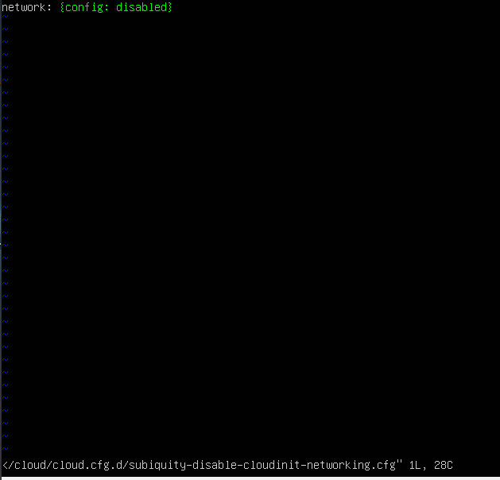

- В файле netplan `/etc/netplan/00-installer-config.yaml` заданы статические параметры: IP — 10.0.2.45/24, шлюз — 10.0.2.2, DNS — 1.1.1.1 и 8.8.8.8.
    ```
    sudo vim /etc/netplan/00-installer-config.yaml
    ```
    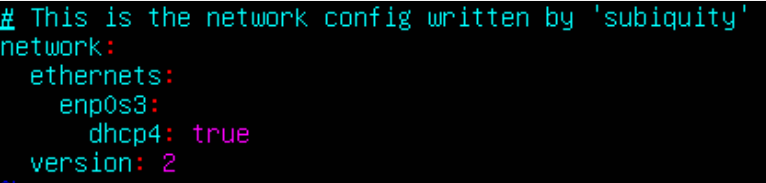
    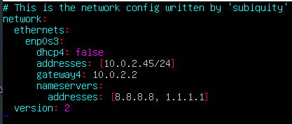

- Изменения применены командой:
    ```
    sudo netplan apply
    ```

- После перезагрузки проверено, что настройки сохранились:
    ```
    cat /etc/netplan/00-installer-config.yaml
    ```
    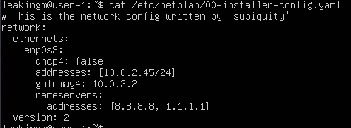

- Проверка статического IP:
    ```
    ip route show
    ifconfig
    ```
    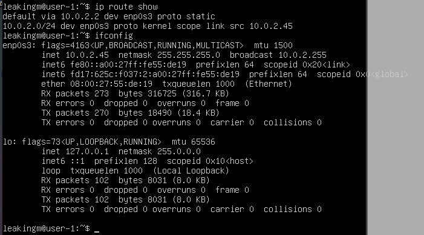

- После перезагрузки статический IP остался прежним.

---

- Проверена доступность внешних ресурсов:
    ```
    ping 1.1.1.1 -c 3
    ping ya.ru -c 3
    ```
    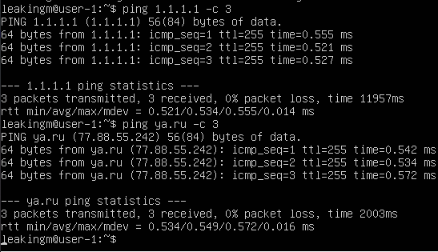

- В обоих случаях получено `0% packet loss`, что подтверждает работоспособность соединения.

- **Ping** — утилита для проверки доступности узлов в сети и измерения задержек.

## Part 4. Обновление ОС

**== Задание ==**

##### Обновить системные пакеты до последней на момент выполнения задания версии.  

- После обновления системных пакетов, если ввести команду обновления повторно, должно появится сообщение, что обновления отсутствуют.
- Вставить скриншот с этим сообщением в отчёт.

**== Решение ==**

- Индекс пакетов обновлён командой:
    ```
    sudo apt update
    ```
- Пакеты обновлены до актуальных версий:
    ```
    sudo apt full-upgrade
    ```
    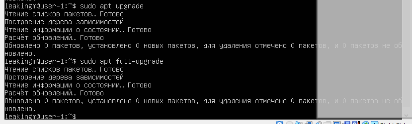

- При повторном запуске команд появляется сообщение об отсутствии новых обновлений.

## Part 5. Использование команды **sudo**

**== Задание ==**

##### Разрешить пользователю, созданному во второй части, выполнять команду sudo.

- В отчёте объяснить *истинное* назначение команды sudo (про то, что это слово - "волшебное", писать не стоит).  
- Поменять hostname ОС от имени пользователя, созданного в этой части (используя sudo).
- Вставить скрин с изменённым hostname в отчёт.

**== Решение ==**

- Пользователь `newuser` добавлен в группу `sudo`:
    ```
    sudo usermod -a -G sudo newuser
    ```
- Проверка групп пользователя:
    ```
    groups newuser
    ```
    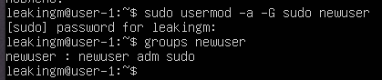

- Теперь `newuser` может выполнять команды с правами суперпользователя через `sudo`.

- **Sudo (Substitute user and do)** — утилита для запуска программ с привилегиями другого пользователя, обычно root.

- Смена пользователя на `newuser`:
    ```
    su newuser
    ```
    

- Проверка текущего имени хоста:
    ```
    hostnamectl
    ```
- Смена имени хоста на `user-2`:
    ```
    sudo hostnamectl set-hostname user-2
    ```
- Проверка результата:
    ```
    hostname
    ```
    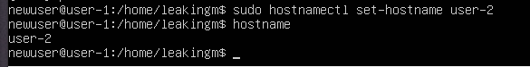

- После перезагрузки имя хоста осталось изменённым:
    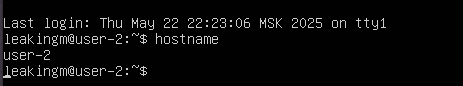

## Part 6. Установка и настройка службы времени

**== Задание ==**

##### Настроить службу автоматической синхронизации времени.  

- Вывести время, часового пояса, в котором вы сейчас находитесь.
- Вывод следующей команды должен содержать `NTPSynchronized=yes`: \
  `timedatectl show`
- Вставить скрины с корректным временем и выводом команды в отчёт.

**== Решение ==**

- Текущее время и часовой пояс выведены командой `date`.

- Для проверки синхронизации времени использована команда:
    ```
    timedatectl show
    ```
    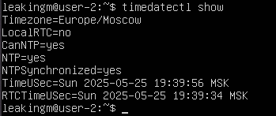

- В выводе команды видно `NTPSynchronized=yes`, что говорит о включённой синхронизации времени по NTP (Network Time Protocol).

## Part 7. Установка и использование текстовых редакторов 

**== Задание ==**

##### Установить текстовые редакторы **VIM** (+ любые два по желанию **NANO**, **MCEDIT**, **JOE** и т.д.)  
##### Используя каждый из трех выбранных редакторов, создайте файл *test_X.txt*, где X -- название редактора, в котором создан файл. Напишите в нём свой никнейм, закройте файл с сохранением изменений.  
- В отчёт вставьте скриншоты:
  - Из каждого редактора с содержимым файла перед закрытием.
- В отчёте укажите, что сделали для выхода с сохранением изменений.
##### Используя каждый из трех выбранных редакторов, откройте файл на редактирование, отредактируйте файл, заменив никнейм на строку "21 School 21", закройте файл без сохранения изменений.
- В отчёт вставьте скриншоты:
    - Из каждого редактора с содержимым файла после редактирования.
- В отчёте укажите, что сделали для выхода без сохранения изменений.
##### Используя каждый из трех выбранных редакторов, отредактируйте файл ещё раз (по аналогии с предыдущим пунктом), а затем освойте функции поиска по содержимому файла (слово) и замены слова на любое другое.
- В отчёт вставьте скриншоты:
    - Из каждого редактора с результатами поиска слова.
    - Из каждого редактора с командами, введёнными для замены слова на другое.

**== Решение ==**

- Установлены редакторы:
    ```
    sudo apt install vim
    sudo apt install nano
    sudo apt install mcedit
    ```
    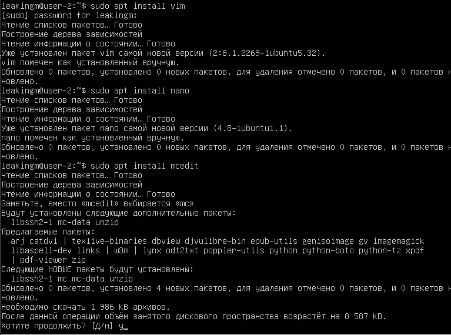

---

### Запись никнейма в файлы и закрытие с сохранением

- **VIM**: Введён никнейм `leakingm`, для сохранения и выхода — `ESC`, затем `:wq`.
    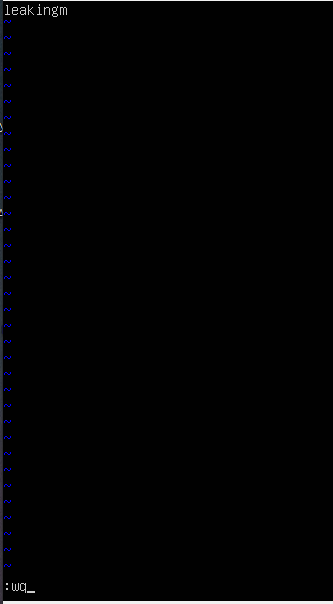

- **NANO**: Введён никнейм `leakingm`, для сохранения — `Ctrl+S`, затем `Ctrl+X`.
    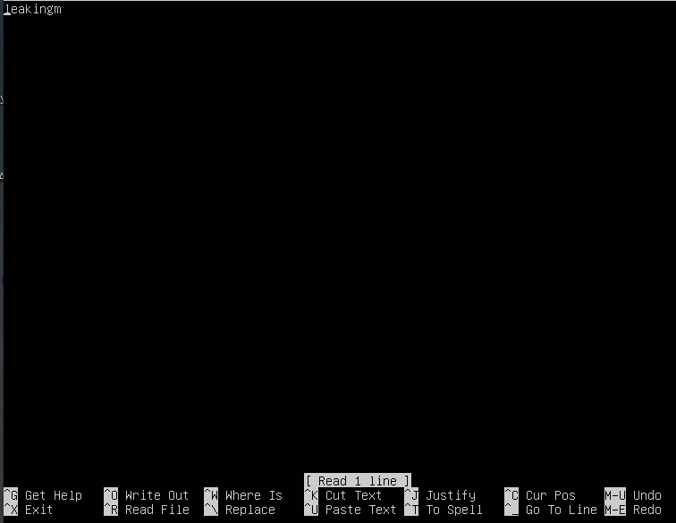

- **MCEDIT**: Введён никнейм `leakingm`, для сохранения — `F10`, выбрать `Yes`.
    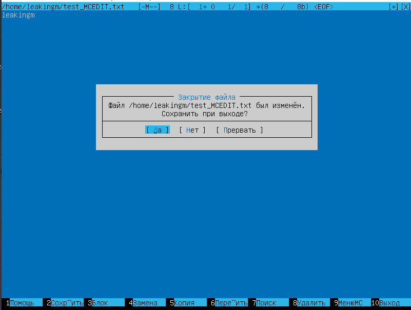

---

### Запись "21 School 21" в файлы с выходом без сохранения

- **VIM**: Введено "21 School 21", выход без сохранения — `ESC`, затем `:q!`.
    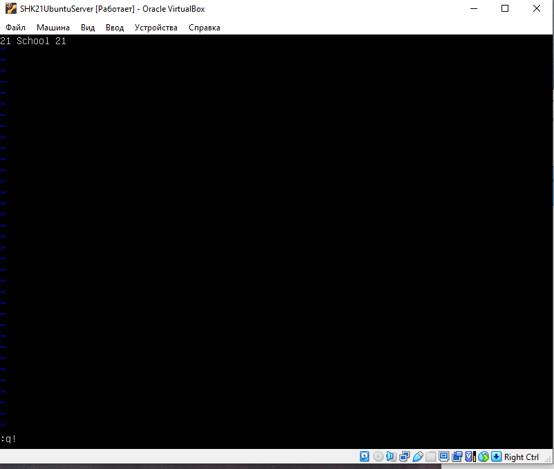
    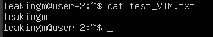

- **NANO**: Введено "21 School 21", выход без сохранения — `Ctrl+X`, затем `N`.
    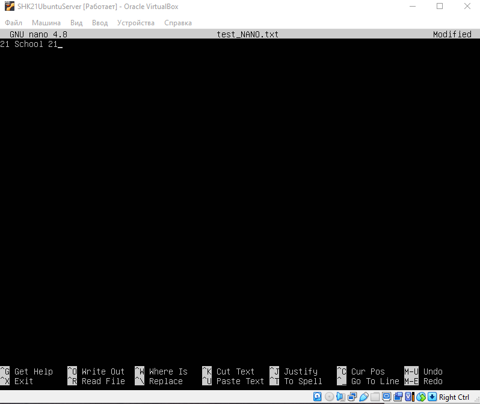
    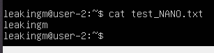

- **MCEDIT**: Введено "21 School 21", выход без сохранения — `F10`, выбрать `No`.
    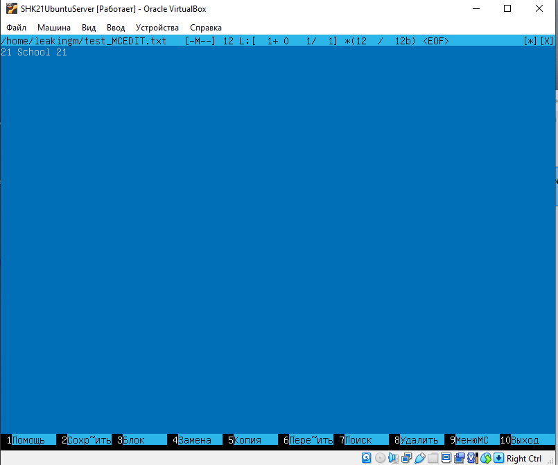
    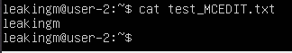

---

### Поиск по слову и замена в редакторах

- Внесены изменения ("21 School 21") и сохранены.

- **VIM**
    - Поиск: `ESC + /<слово>`
        
    - Замена: `:s/<старое>/<новое>`
        

- **NANO**
    - Поиск: `Ctrl+W`
        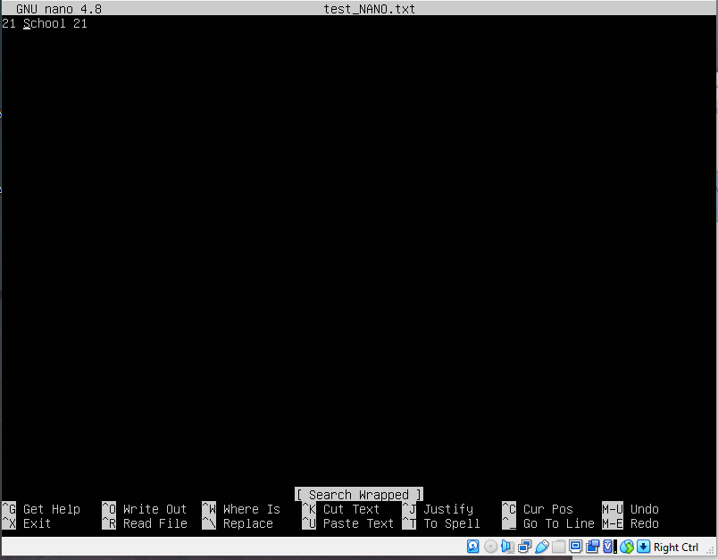
    - Замена: `Ctrl+\`
        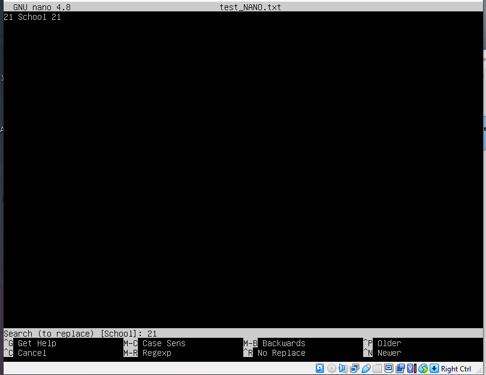
    - Ввод слова для замены:
        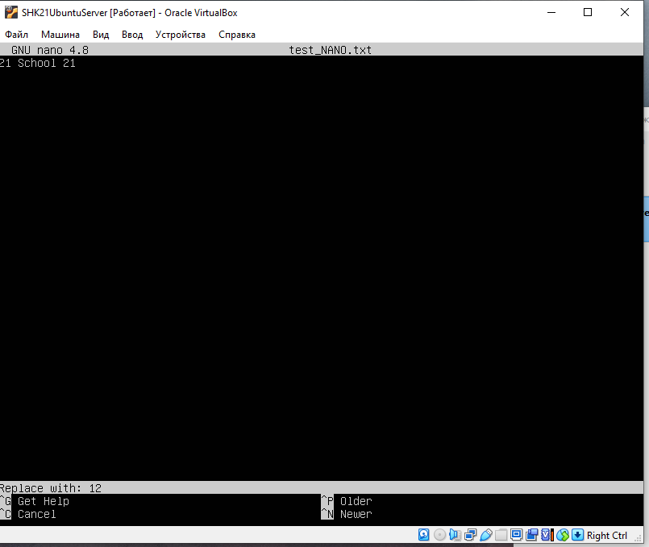
    - Применение замены:
        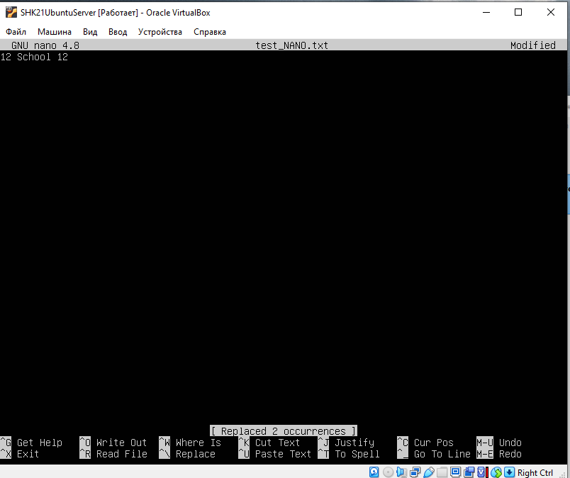

- **MCEDIT**
    - Поиск: `F7`
        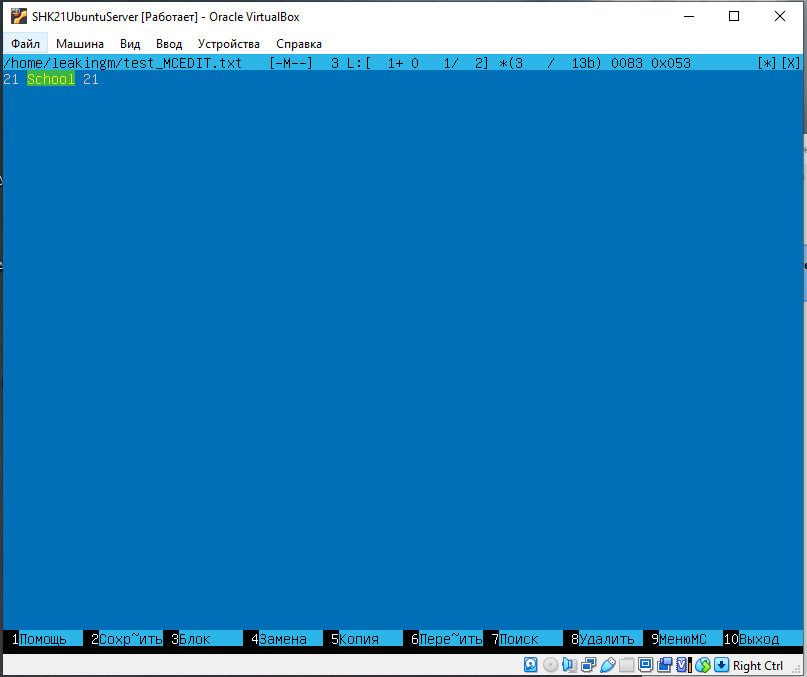
    - Ввод слова для поиска:
        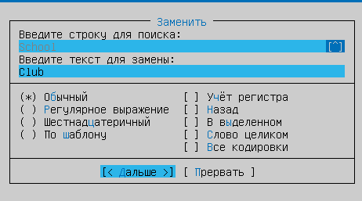
    - Замена: `F4`
    - Ввод слова для замены:
        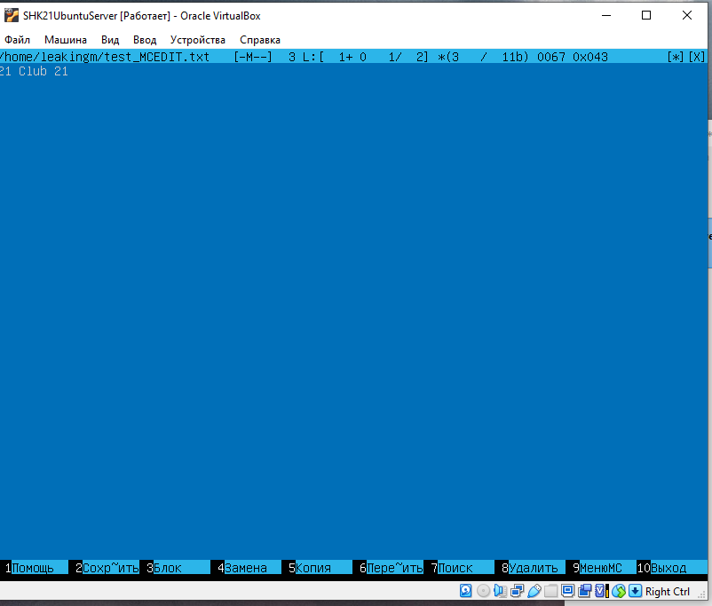
    - После ввода слова для замены в MCEDIT подтверждаем действие, и редактор выполняет замену найденного слова на новое. После этого можно выйти из редактора, сохранив изменения, чтобы убедиться, что замена прошла успешно.

---

## Part 8. Установка и базовая настройка сервиса **SSHD**

**== Задание ==**

##### Установить службу SSHd.  
##### Добавить автостарт службы при загрузке системы.  
##### Перенастроить службу SSHd на порт 2022.  
##### Используя команду ps, показать наличие процесса sshd. Для этого к команде нужно подобрать ключи.
- В отчёте объяснить, почему процесс sshd присутствует в списке процессов после запуска сервиса.

**== Решение ==**

- Для начала был установлен пакет openssh-server с помощью команды:
    ```
    sudo apt install openssh-server
    ```
    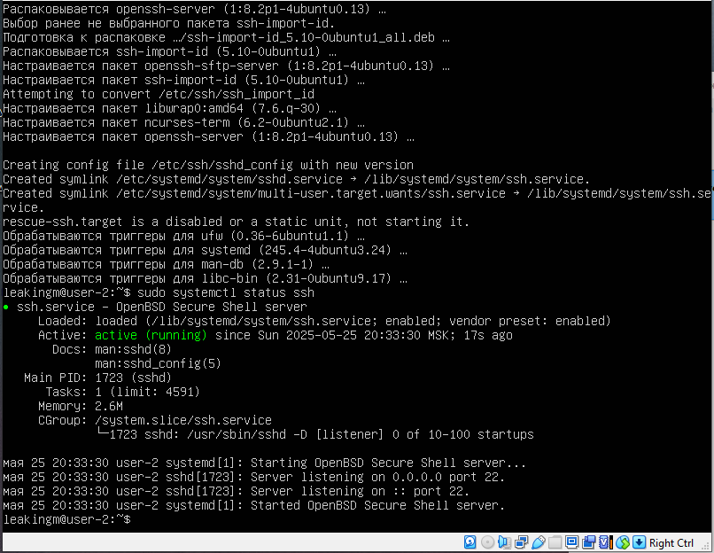

- Чтобы SSHd запускался автоматически при старте системы, была выполнена команда:
    ```
    sudo systemctl enable ssh
    ```
    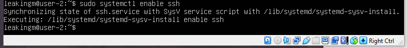

- Для смены стандартного порта SSH на 2022, в конфигурационном файле `/etc/ssh/sshd_config` был изменён параметр `Port`:
    ```
    sudo vim /etc/ssh/sshd_config
    ```
    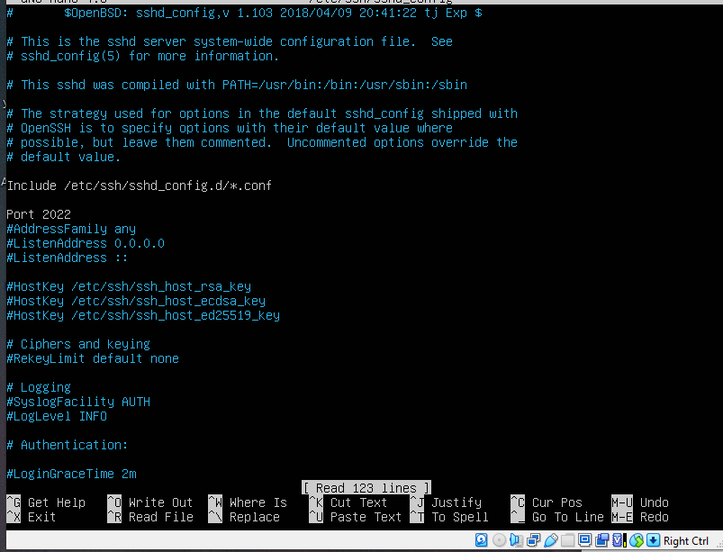

- После внесения изменений служба SSH была перезапущена:
    ```
    sudo systemctl restart ssh
    ```
    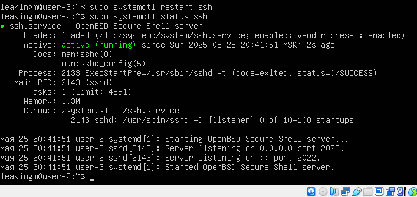

- Для проверки наличия процесса sshd использована команда:
    ```
    ps aux | grep sshd
    ```
    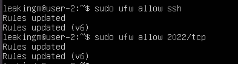

- На скриншоте видно, что процесс sshd присутствует в списке процессов. Это объясняется тем, что служба sshd работает в фоновом режиме и обеспечивает возможность удалённого подключения к серверу по протоколу SSH.

---

- На скриншоте видно, что процесс sshd работает. Это объясняется тем, что служба sshd функционирует в фоновом режиме и обеспечивает возможность удалённого подключения к серверу по протоколу SSH.

---

## Part 9. Проверка работы SSH на новом порту

**== Задание ==**

##### Осуществить подключение к серверу по SSH с помощью утилиты ssh, указав новый порт.  
##### В отчёте вставить скриншот успешного подключения.

**== Решение ==**

- Для подключения к серверу по SSH на порту 2022 использована команда:
    ```
    ssh newuser@127.0.0.1 -p 2022
    ```
    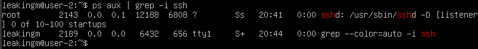

- На скриншоте видно, что подключение прошло успешно: отображается приглашение командной строки для пользователя `newuser`.

---

## Part 10. Настройка брандмауэра (firewall)

**== Задание ==**

##### Установить и настроить ufw (Uncomplicated Firewall) для ограничения входящих соединений только на необходимый порт SSH.  
##### В отчёте привести команды настройки и скриншот состояния брандмауэра.

**== Решение ==**

- Для установки ufw выполнена команда:
    ```
    sudo apt install ufw
    ```
    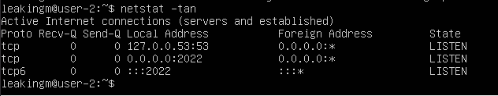

- Разрешён только порт 2022 для SSH:
    ```
    sudo ufw allow 2022/tcp
    ```
    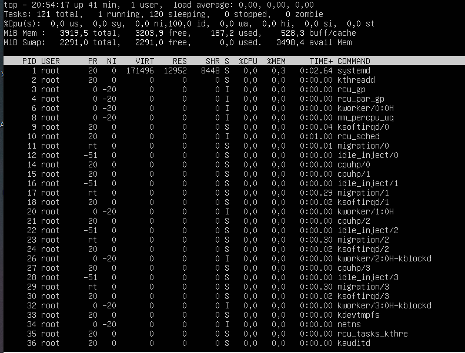

- Включён сам брандмауэр:
    ```
    sudo ufw enable
    ```
    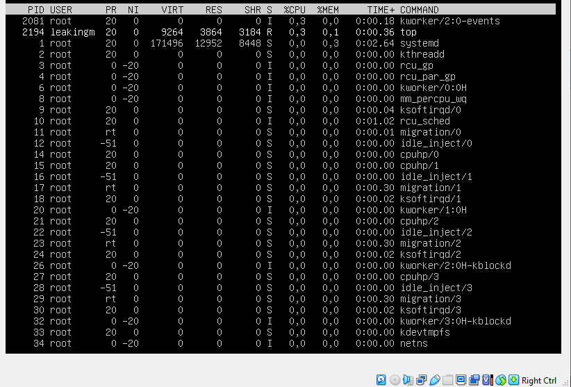

- Статус брандмауэра проверен командой:
    ```
    sudo ufw status
    ```
     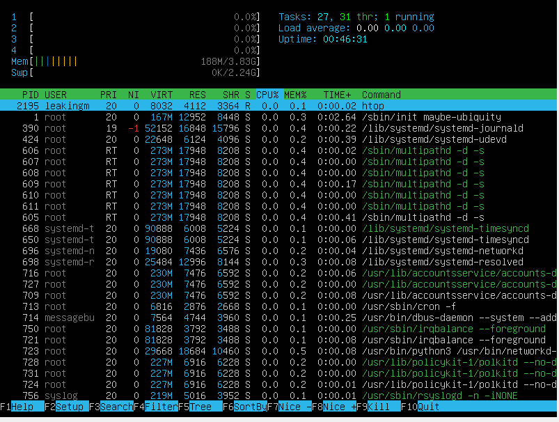

---
